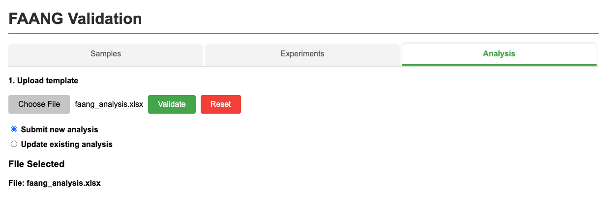
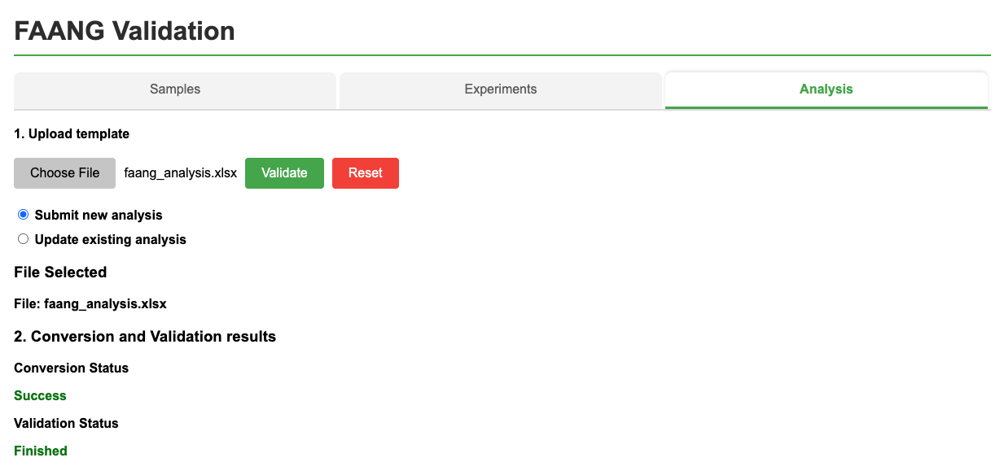
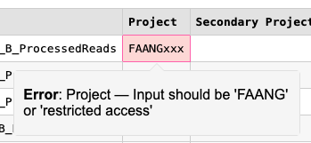

# Validation

## 1. Validation
The filled out template can be validated against the FAANG rules, using the 
[on-line tool](https://data.faang.org/validation/analyses). It will provide a 
You can upload your completed Analysis template in the same way as your Sample metadata template.
This will allow the system to identify and report any errors that must be resolved before submission.

Please contact [FAANG DCC](mailto:faang-dcc@ebi.ac.uk) if you have any concerns about the validation result.

To start validation please follow these steps:

1. Click on **'Analysis''** tab
   

2. Click on **'Choose file''** button to choose filled out template file

3. Select the option of either making a new submission or updating existing ones.
Upon file selection, the 'Validate' or 'Reset' button is displayed. Click on the 'Validate' button to upload the file 
and run the validation service.
   

4. Check **'Status'** badge for updates. It might have three different values:
    * Waiting
    * Success
    * Errors
   

5. Review all **'Errors'** and **'Warnings'**. For this click on the cell
that contains any issues, pop-up window will have detailed information about
**'Errors'** and **'Warnings'**. It's also possible to download table annotated
with **'Errors'** and **'Warnings'** messages using **"Get annotated template"** 
button.
   
   

**'Errors'** are problems that have to be dealt with. You will not be able to 
convert the FAANG analysis spreadsheet to the ENA XML format if 
the spreadsheet contains errors. **'Warnings'** are items for you to review. 
They might be fine, but you need to decide. Any warnings left in a submission 
are likely to be reviewed by the FAANG DCC. You may be asked to update the 
analysis record later if the metadata group agrees a certain value should be 
improved.

Metadata fields are organized into biologically-meaningful type schemas, 
for example a **'ena'** or **'faang'**. Also 
template could have module fields (**eva**). 

For each of these types of schemas **'Errors'** and **'Warnings'** information
will be provided in **'Validation results'** section.

Having run the validation tool on your spreadsheet, you will need to update it 
to deal with the errors shown. Review the warnings and consider making changes 
to deal with these. Re-validate your spreadsheet, and repeat the process until 
there are no errors left and you are comfortable with everything that has 
triggered a warning. If there are some things that you cannot resolve, 
contact [FAANG DCC](mailto:faang-dcc@ebi.ac.uk) for help. Eventually, you will 
have a set of metadata that passes the validation checks and is ready for 
submissiom.
