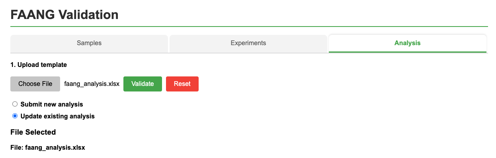

# Updating existing analysis data in ENA using the FAANG interface

To update existing ENA records, use the same submission template as the original submission. This process will update 
the analysis details with the metadata provided in your spreadsheet. 
Ensure that the spreadsheet includes the original alias used during the initial submission. Note that analysis entries cannot be updated to reference different data files.

## Update Process

1. Select the **"Update existing analysis"** option in the validation tool

2. Upload your completed template containing the data you want to update

3. Ensure each entry in your spreadsheet contains the original **alias** used during the initial submission

This action will update the submission details with the metadata you provide, so ensure all information is accurate before submission.

