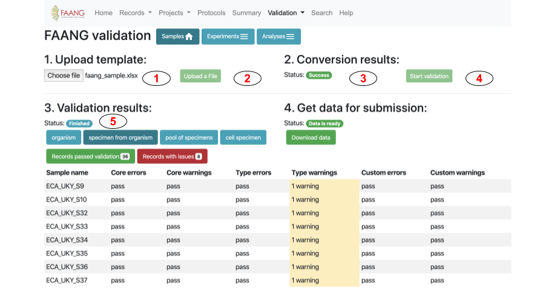
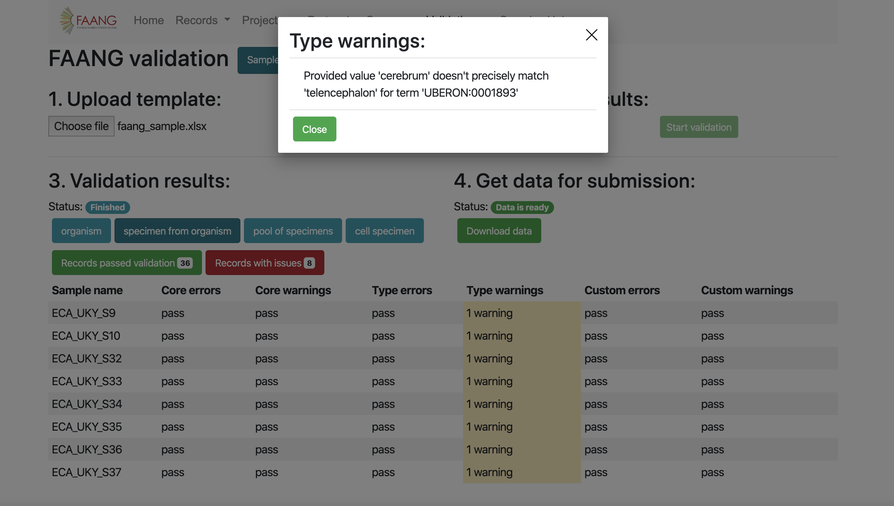
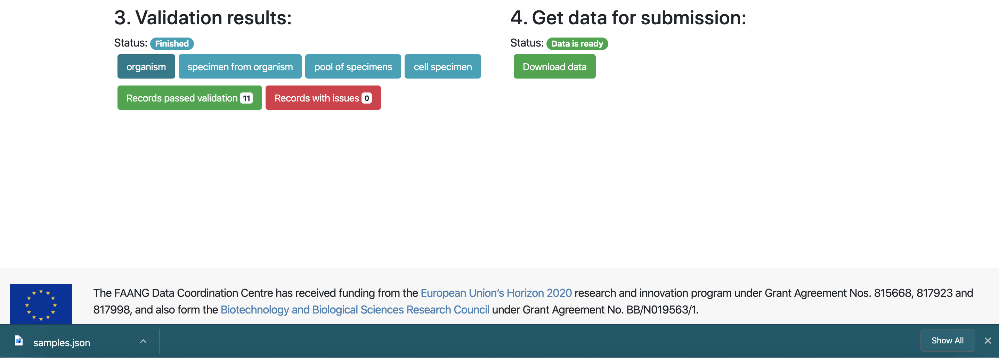

# Validation and Conversion

## 1. Validation
The filled out template can be validated against the FAANG rules, using the 
[on-line tool](https://data.faang.org/validation/samples). It will provide a 
report highlighting problems for review. This is under development, so please 
query [FAANG DCC](mailto:faang-dcc@ebi.ac.uk) if you have any concerns about 
the validation result.

To start validation please follow these steps:

1. Click on **'Choose file''** button to choose filled out template file
2. Click on **'Upload a File'** button to upload template to validation service

3. Check **'Status'** badge for updates. It might have three different values:
    * Waiting
    * Success
    * Errors
4. If status has **'Success'** value you can start validation. For this click
on **'Start validation'** button
5. Check **'Status'** badge in **'3. Validation results:'** section for updates.
It might have three different values:
    * Waiting
    * Success
    * Errors
6. Review all **'Errors'** and **'Warnings'**. For this click on the cell
that contains any issues, pop-up window will have detailed information about
**'Errors'** and **'Warnings'**

**'Errors'** are problems that have to be dealt with. You will not be able to 
convert the FAANG sample spreadsheet to the BioSamples JSON format if 
the spreadsheet contains errors. **'Warnings'** are items for you to review. 
They might be fine, but you need to decide. Any warnings left in a submission 
are likely to be reviewed by the FAANG DCC. You may be asked to update the 
sample record later if the metadata group agrees a certain value should be 
improved.

For descriptions and explanations of the different error messages that the 
validation tool can provide please see [FAANG validation error message 
explanations](faang_validation_error_message_explanation.md).

Metadata fields are organized into biologically-meaningful type schemas, 
for example a **'specimen from organism'** or **'cell specimen'**. Each type 
schema inherits a core schema, containing the minimal fields necessary for 
that type ([standard rule group](
https://data.faang.org/ruleset/samples#standard) in samples ruleset). Also 
template could have custom fields (defined by user). 

For each of these types of schemas **'Errors'** and **'Warnings'** information
will be provided in **'3. Validation results'** section, for example **'Core errors'** or
**'Type warnings'**.

Having run the validation tool on your spreadsheet, you will need to update it 
to deal with the errors shown. Review the warnings and consider making changes 
to deal with these. Re-validate your spreadsheet, and repeat the process until 
there are no errors left and you are comfortable with everything that has 
triggered a warning. If there are some things that you cannot resolve, 
contact [FAANG DCC](mailto:faang-dcc@ebi.ac.uk) for help. Eventually, you will 
have a set of metadata that passes the validation checks and is ready for 
conversion.

## 2. Conversion
To start conversion you need to fix all **'Errors'** in template. When data
is ready follow these steps to get converted data in JSON format:

1. Click on **'Get submission data'** button (it will start conversion process)
2.  Check **'Status'** badge in **'4. Get data for submission:'** section for 
updates.
3. Click on **'Dowload data'** button to get JSON file that is suitable for
BioSamples submission.
