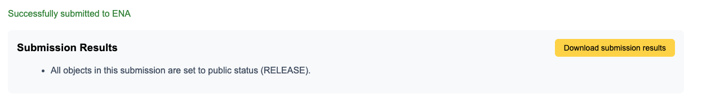

# Submit the XML files to ENA
Before you start you **MUST** have submitted all of your sample data to BioSamples, 
please refer to the [instructions](../sample/biosamples_template.md) to 
achieve this.

1. Register for an ENA submission account if you do not already have one 
[https://www.ebi.ac.uk/ena/submit/sra/#registration](https://www.ebi.ac.uk/ena/submit/sra/#registration)
    * More detailed instructions on account registration can be found here 
    [http://ena-docs.readthedocs.io/en/latest/reg_01.html](
    http://ena-docs.readthedocs.io/en/latest/reg_01.html)
2. Upload your sequencing data to your account area
    * Follow one of the submission methods detailed on the following page 
    [http://ena-docs.readthedocs.io/en/latest/upload_01.html](
    http://ena-docs.readthedocs.io/en/latest/upload_01.html)
        * The main options are to use the webin Java client, FTP transfer or 
        the Aspera client. These will require you to have registered for an 
        ENA submission account first.
        * Please read this page and make sure to use one of the supported 
        file formats [http://ena-docs.readthedocs.io/en/latest/format_01.html](
        http://ena-docs.readthedocs.io/en/latest/format_01.html)
    * Remember you will need to provide md5 checksum value for every file you 
    upload to ensure the integrity of uploaded file, 
    see [http://ena-docs.readthedocs.io/en/latest/upload_01.html#file-md5-checksums](http://ena-docs.readthedocs.io/en/latest/upload_01.html#file-md5-checksums)
    * If you have a large number of files to upload, you may want to create a 
    manifest file that can then be supplied to aspera 
    (using '--file-list=/PATH/TO/FILELIST’) for example to list which files 
    need to be uploaded.  This can be created programatically in unix using a 
    command similar to 'find /PATH/TO/BASESEQUENCINGDIRECTORY -name "*.fq" > 
    asperafilelist.txt’.

3. After successful validation you should be allowed to do a submission to ENA. You will need to provide your credentials.

4After submission you will get results on data portal, also browser will 
start automatic download of **submission_results.xml** file. If it won't happen 
please use **"Download submission results""** button. It's really important to 
save this xml file in a safe place for further reference.

6. Check for validation fails post submission (files are not checked until 
after submission), so it may be some time before you are emailed regarding 
any errors or success.

Please contact [FAANG DCC](mailto:faang-dcc@ebi.ac.uk) if you have any issues with any of the processes on this page.