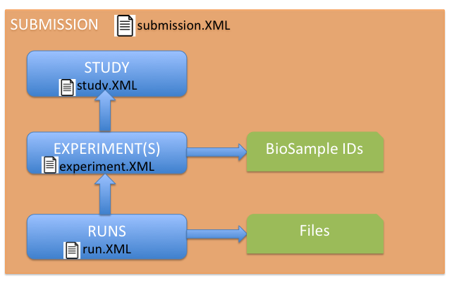

# Overview
This page will guide you through the process of submitting your sequencing 
data to [European Nucleotide Archive (ENA)](https://www.ebi.ac.uk/ena) using 
RESTful method. How to use Webin-CLI to make the submission will be updated 
very soon. In this document, ENA and the read archives are used interchangeably 
and other reads databases will be referred individually by their names. 
If you have any questions about this process please contact 
[FAANG Data Coordination Centre (DCC)](mailto:faang-dcc@ebi.ac.uk) for help. 

## Prerequisites
1. You must have already [submitted your sample information](
biosamples_template.md) and obtained your 
BioSample accessions ahead of submitting sequencing data.  You must then use 
these FAANG BioSample accessions in your sequencing data submissions to the 
read archives. Your BioSample accessions start with SAMEA followed by a 
unique number.
2. Determine which archive is most appropriate for your assay data, if in 
doubt please contact [FAANG DCC](mailto:faang-dcc@ebi.ac.uk) for guidance.
3. Read the [FAANG experiment metadata guidelines](
https://data.faang.org/ruleset/experiments#standard) and gather the required 
information to meet the standards, this may require you to contact your 
sequencing centre for example. The template below can be useful for gathering 
this information prior to starting the submission process. The template can 
also be used with the [FAANG conversion tool](
https://data.faang.org/validation/experiments) to create the XML documents 
required for submission to the [European Nucleotide Archive (ENA)](
http://www.ebi.ac.uk/ena).

**IMPORTANT: FAANG is not supported by the [ENA webin based submission process](https://www.ebi.ac.uk/ena/submit/sra/#home). 
FAANG experiment data must be submitted to ENA using the process described on 
this page that involves a brokered submission via the [FAANG data portal](https://data.faang.org/validation/experiments)**

**You must be able to find your records by searching the BioSamples accession 
in the search box at the top right corner of BioSamples web pages before 
submitting any experimental assays, which indicates that your samples have 
been properly indexed and searchable by ENA. This process normally takes 
about 24 hours, but may take longer in peak periods.**

Steps required to submit sequencing data:

1. [Download the Excel template](#1-download-the-excel-template) 
2. [Complete the template](#2-complete-the-template)

## 1. Download the Excel template
* Download the latest version of the [Excel template](
https://data.faang.org/assets/empty/faang_experiment.xlsx)
* You can also download an [example template](
https://data.faang.org/assets/with_examples/faang_experiment.xlsx) to refer to for advice on 
completion

Please refer to [ENA guidance](http://www.ebi.ac.uk/ena/submit) on the requirements for submission and to the 
latest [experiment ruleset specification](https://data.faang.org/ruleset/experiments#standard). The rules for each attribute define 
if it is mandatory or optional and what sort of data is expected (numeric, 
date, text, etc.).

The above template can be used to gather the required information to meet the 
FAANG experimental standards.  It is also possible to use this template with 
the [FAANG conversion tool](https://data.faang.org/validation/experiments) to 
generate the required XML documents for submission to 
[European Nucleotide Archive (ENA)](http://www.ebi.ac.uk/ena). You will 
currently have to manage your own submission to other archives and for more 
complex data types, but please contact [FAANG DCC](mailto:faang-dcc@ebi.ac.uk) 
to see if we can help you with your submission or look into supporting your 
requirements in future releases.

**IMPORTANT: The data validation service is not compatible with templates 
prepared using Libre Office Calc, please use Microsoft Excel saving as xslx or 
Google sheets exporting as xslx.**

This spreadsheet is divided into a number of tabs within which the required 
information is gathered to record Submission, Study, Experiment and Run 
information for an ENA submission.  It also can be useful for gathering 
information for submission to other archives by just completing the 
relevant assay specific tab e.g. 'RNA-seq'.  
Do not alter or delete any of the column headings or tabs from the file.

Guidance for completion of this template for submission to the 
[European Nucleotide Archive (ENA)](http://www.ebi.ac.uk/ena) is further down 
this page.  If you have any questions about the use of this template please 
contact [FAANG DCC](mailto:faang-dcc@ebi.ac.uk) for help.

## 2. Complete the template
Before starting filling the template, it will be helpful to understand the 
relationships among entities which are going to be filled in the template.

The below schematic shows what the conversion tool will create for you from 
your filled-out template file, which also indicates the relationships among 
submission, study, experiments and runs. In each template file, there will 
be one and only one study, which documents high level information, the best 
analog is a publication. The study can have one or multiple experiments. 
Within each experiment, multiple specimen can be referenced by BioSample IDs 
because these specimen samples must have been previously submitted to 
BioSamples already. On top of samples, the experiment XML also records the 
details of your experiment. The run XML will reference the details of the 
files that you upload to ENA. Finally a submission is a container which 
include all entities including study, experiments and runs and gives 
instructions on how to process the submission. Therefore there is only one 
submission record per template file, as the study. 

The same specimen sample can appear in different experiments in the same 
study according to different experiment conditions. The most common scenarios 
include different sequencing platforms used on the same sample, or the 
different storage conditions, e.g. investigating sperm activity level between 
fresh and after freezing under -80 degree.

###### Controlled Vocabularies
For some fields (e.g. **'Study Type'** in **'study'** tab, **'Library Strategy'** in 
**'experiment ena'** tab etc.), there are limited values allowed for those fields 
(see below description for details of allowed values). To reflect this in the 
template files, drop-down menus populated with allowed values have been added 
to those fields since version 20170731.

###### Tabs in the template file
###### 'submission' tab
The submission tab records the unique alias used to describe your submission 
and the main institution representing the submission.

**alias:** provide a unique alias for your submission e.g. "SUS_RI_DUR_RS_SU1"

**Hold Until Date:** To follow the prepublication principles of FAANG, please 
set your data to be released immediately by not setting the **'Hold Until Date'** 
field, format to use is YYYY-MM-DD e.g. 2017-04-01. The field is included here 
in case there are compelling reasons that this is required, please contact 
[FAANG DCC](mailto:faang-dcc@ebi.ac.uk) to discuss this.

###### 'study' tab
The study tab is used to describe the sequencing study including a title, 
a study type and a description which could be seen as similar to an abstract 
as it would appear in a publication.

**Study Alias:** a unique alias for your submission e.g. "SUS_RI_DUR_RS_ST1".

**Study Title:** Provide an informative human readable name for your study 
e.g. "Pig transcriptome and gene expression atlas".

**Study Type:** For an up to date list of study types please check [this file](https://github.com/enasequence/schema/blob/master/src/main/resources/uk/ac/ebi/ena/sra/schema/SRA.study.xsd). 
The list of accepted values are provided as drop-down menu option in the 
template. If you need to use "Other" please contact [FAANG DCC](mailto:faang-dcc@ebi.ac.uk) for advice on 
how to proceed.

**Study Abstract:** You can include information here about your study, 
which could be seen as similar to an abstract as it would appear in publication. 
**It is recommended that you include the following Data reuse statement as part 
of your Project ABSTRACT/DESCRIPTION with any data submission** 
"This study is part of the FAANG project, promoting rapid prepublication of 
data to support the research community. These data are released under 
Fort Lauderdale principles, as confirmed in the Toronto Statement 
(Toronto International Data Release Workshop. Birney et al. 2009. 
Pre-publication data sharing. Nature 461:168-170). Any use of this dataset 
must abide by the FAANG data sharing principles. Data producers reserve the 
right to make the first publication of a global analysis of this data. If you 
are unsure if you are allowed to publish on this dataset, please contact 
the FAANG Data Coordination Centre and FAANG consortium (email faang-dcc@ebi.ac.uk and cc faang@iastate.edu) to enquire. The full guidelines can be found at 
[http://www.faang.org/data-share-principle](http://www.faang.org/data-share-principle)."

###### 'experiment ena' tab
The experiment XML is used to describe the experimental setup including 
instrument and library preparation details, and any additional information 
required to correctly interpret the submitted data. You need an experiment row 
for each of your specimen on which the experiment was run including 
BioSampleIDs and also where any of the experimental conditions differ between 
runs. Each experiment row references a study and a sample. For this tab any 
fields that cannot be provided should be left blank rather than using the 
FAANG terms for missing values such as 'not applicable', 'not collected' etc.

Experiment information is split across a number of the excel template tabs, 
the ENA specific experiment information on the **'experiment ena"** tab, the 
FAANG experimental rules on the series of assay specific tabs such as atac-seq, some of which 
you will need to complete depending on the assay type you are submitting. For 
recording your experiment information you can use your **'Sample Descriptor'** 
(BioSample ID) and a unique experiment alias (that you make up) as the keys for 
each specimen in the experiment tabs so that you can record the required 
information for a single experiment across each of the required tabs. For each 
BioSample ID you will need to complete a row in the **'experiment ena'**, 
and one (or more) of the assay specific tabs (depending on 
the data you are submitting). You will do this using the same **'Sample Descriptor'** 
and experiment alias to link this information from each of the tabs together.  
Refer to the [latest experiment ruleset specification](
https://data.faang.org/ruleset/experiments#standard) for completing the 
assay specific tabs to the appropriate standard, this can then be verified 
using the [FAANG validation tool](https://data.faang.org/validation/experiments).

**Sample Descriptor:** This is the BioSampleID that you have already 
submitted to BioSamples referring to the specimen, cell culture or cell line 
from which the assay was taken. Your BioSample accessions start with SAMEA 
followed by a unique number e.g. SAMEA103886149. 

**Experiment alias:** a unique alias for each experiment e.g. 
"SUS_RI_DUR21-06_2023N006".

**Title:**  Provide an informative human readable name for your study e.g. 
"Pig transcriptome and gene expression atlas". Expected to be same as the one 
used on the submission tab.

**Study_Ref:** The unique study alias that you used on your study tab e.g. 
"SUS_RI_DUR_RS_ST1".

**Design Description:** Record the goal and setup of the individual library 
including how the library was constructed e.g. "RNA-Seq transcriptomic paired 
end experiment using inverse rRNA selection on an Illumina HiSeq 2500".

**Library Name:** a unique name for your library preparation e.g. '2023N006'.

**Library Strategy:** Sequencing technique intended for this library, use the 
drop-down menu for valid values e.g. 'RNA-Seq'.

**Library Source:** The Library Source specifies the type of source material 
that is being sequenced, use the drop-down menu for valid values e.g. 
'TRANSCRIPTOMIC'.

**Library Selection:** Method used to enrich the target in the sequence 
library preparation, use the drop-down menu for valid values e.g. 
'Inverse rRNA selection'.

**Library Layout:** Specifies whether to expect 'SINGLE' OR 'PAIRED'. In the 
case of paired reads, information about the relative distance and orientation 
needs to be  specified in the NOMINAL_LENGTH and NOMINAL_SDEV fields.

**Nominal Length:** For paired end reads only record the nominal length e.g. 
'400'.

**Nominal Sdev:** For paired end reads only record the standard deviation 
e.g. '1.6'.

**Library Construction Protocol:** The field from ENA, using free text to 
describe the protocol by which the sequencing library was constructed e.g. 
'TruSeq Stranded mRNA Sample Preparation Guide Revision E'

**Platform:** This field selects which sequencing platform and 
platform-specific runtime parameters e.g. 'ILLUMINA', this will be informed by 
your sequencing center.

**Instrument Model:** The specific instrument model of your sequencing 
platform e.g. 'Illumina HiSeq 2500', this will be informed by your sequencing 
center. A full list of accepted terms for models is available in the ENA 
schema file [ftp://ftp.sra.ebi.ac.uk/meta/xsd/sra_1_5/SRA.common.xsd](ftp://ftp.sra.ebi.ac.uk/meta/xsd/sra_1_5/SRA.common.xsd) 
please contact [faang-dcc@ebi.ac.uk](mailto:faang-dcc@ebi.ac.uk) if you need assistance with selecting 
an instrument model.

###### Assay specific tabs
For completion of the FAANG standard rules please refer to the 
[latest experiment ruleset specification](https://data.faang.org/ruleset/experiments#standard). 
For each row you need to use the same **'Sample Descriptor'** and 
**'Experiment alias'** from the **'experiment ena'** tab.

**Sample Descriptor:** This is the BioSampleID that you have already submitted 
to BioSamples referring to the specimen, cell culture or cell line from which 
the assay was taken. Your BioSample accessions start with SAMEA followed by a 
unique number e.g. SAMEA103886149. The value used here must be able to be 
matched to one of the values used in the Experiment_ENA tab.

**Experiment alias:** a unique alias for each experiment e.g. 
"SUS_RI_DUR21-06_2023N006".

Complete the remaining fields according to the [experiment ruleset specification](https://data.faang.org/ruleset/experiments#standard).

###### Run tab
The run XML is used to associate data files with experiments, for the run tab 
any fields that cannot be provided should be left blank rather than using the 
FAANG terms for missing values such as 'not applicable' and 'not collected'. 
Further details can be found on the [ENA page](http://www.ebi.ac.uk/ena/submit/preparing-xmls#run).

**Alias:** a unique alias for each run e.g. "140403_D00125_0207_BH8M4FADXX_Run402".

**Run Center:** Name of the sequencing center that generated the runs e.g. 
"Edinburgh Genomics".

**Run Date:** the ENA field, date that the sequencing was performed in 
YYYY-MM-DDTHH:MM:SS format e.g. 2014-04-03T09:30:00 This field should be left 
blank if no date can be provided.

**Experiment Ref:** Reference the experiment that this run refers to, this will 
be the **'Experiment Alias** used on the **'experiment ena'** tab.

**Filename:** The filename of the run file that you will upload (or already 
have uploaded) to ENA 

**Filetype:** The filetype of the file that you will upload (or already have 
uploaded) to ENA 

**Checksum Method:** The checksum method used for validating that the contents 
of the file have been uploaded successfully. At the moment, please use 
"MD5" at all time.

**Checksum:** The value of the checksum of the file to be checked, 
e.g. cd5f2a8dd360403b9d8c7b983ac74047

**Filename Pair:** For the paired file if applicable, instructions are the 
same as for filename.

**Filetype Pair:** For the paired file if applicable, instructions are the 
same as for filetype.

**Checksum Method Pair:** For the paired file if applicable, instructions are 
the same as for checksum_method.

**Checksum Pair:** For the paired file if applicable, instructions are the 
same as for checksum.

## 5. Missing values 
Where data cannot be included in a submission, submit one of these text values 
instead:

* not applicable
* not collected (i.e. will always be missing)
* not provided (i.e. may be added later)
* restricted access (i.e. it isn't missing, we just can't include it in a 
public document)

The use of these values will interact with the metadata validation system as 
follows:

* if an attribute is required:
    * not applicable, not collected, not provided - validation will regard 
    these as an error
    * restricted access - validation will generate a warning
* if an attribute is recommended:
    * not collected, not provided - validation will generate a warning
    * restricted access, not applicable - pass
* if an attribute is optional:
    * validation will fail with any of missing values terms. As this is an 
    optional field it should be left blank if no real data is being provided.
    
If an attribute is optional and you can’t supply it, you should just leave the 
column blank.

Assume that the DCC will ask about anything that seems implausible. e.g. 
**'restricted access'** for species would be queried.
