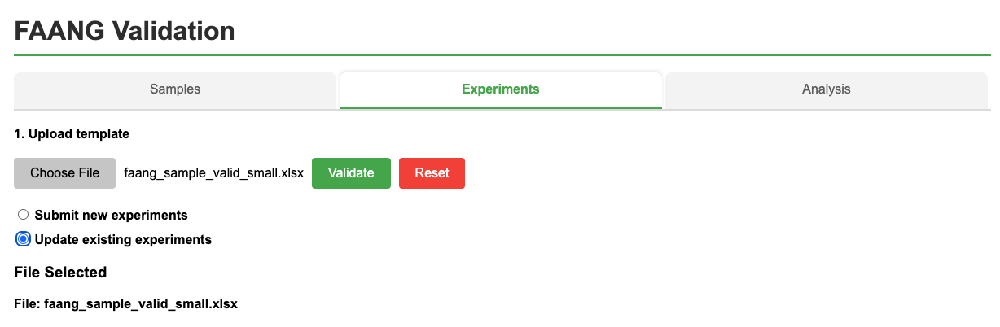

# Updating existing submission in ENA using the FAANG interface

To update existing ENA records, use the same submission template as the original submission. This process will update 
the experiment details with the metadata provided in your spreadsheet. 
Ensure that the spreadsheet includes the original alias used during the initial submission. Note that runs cannot be updated to reference different data files.

## Update Process

1. Select the **"Update existing experiments"** option in the validation tool

2. Upload your completed template containing the data you want to update

3. Ensure each entry in your spreadsheet contains the original **alias** used during the initial submission

**Data Requirements**: This action will update the submission details with the metadata you provide, so ensure all information is accurate before submission.

## Alternative Method

You can update existing ENA submissions directly by following the instructions provided on [this page](ena_updating.md).

