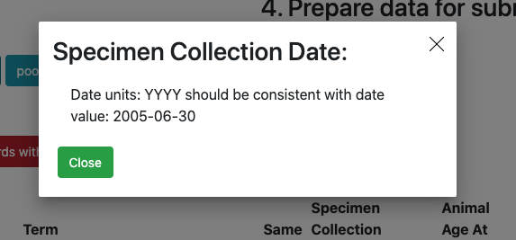

# Validation and Conversion

## 1. Validation
The [FAANG validation tool](https://data.faang.org/validation/experiments) 
will validate required assay specific tabs for any of the assay types contained within the 
[FAANG experiment metadata rules](https://data.faang.org/ruleset/experiments#standard). 
You can upload your completed Experiment 
template, as was possible for your sample metadata template.  This will alert 
you to any errors that need resolving before submission. 
Please contact [FAANG DCC](mailto:faang-dcc@ebi.ac.uk) for 
guidance if required.

To start validation please follow these steps:

1. Click on **'Choose file''** button to choose filled out template file
2. Click on **'Upload a File'** button to upload template to validation service

3. Check **'Status'** badge for updates. It might have three different values:
    * Waiting
    * Success
    * Errors
4. If status has **'Success'** value you can start validation. For this click
on **'Start validation'** button
5. Check **'Status'** badge in **'3. Validation results:'** section for updates.
It might have three different values:
    * Waiting
    * Success
    * Errors
6. Review all **'Errors'** and **'Warnings'**. For this click on the cell
that contains any issues, pop-up window will have detailed information about
**'Errors'** and **'Warnings'**

**'Errors'** are problems that have to be dealt with. You will not be able to 
convert the FAANG experiments spreadsheet to the ENA XML format if 
the spreadsheet contains errors. **'Warnings'** are items for you to review. 
They might be fine, but you need to decide. Any warnings left in a submission 
are likely to be reviewed by the FAANG DCC. You may be asked to update the 
experiment record later if the metadata group agrees a certain value should be 
improved.

For descriptions and explanations of the different error messages that the 
validation tool can provide please see [FAANG validation error message 
explanations](faang_validation_error_message_explanation.md).

Metadata fields are organized into biologically-meaningful type schemas, 
for example a **'ATAC-seq'** or **'DNase-seq'**. Each type 
schema inherits a core schema, containing the minimal fields necessary for 
that type ([standard rule group](
https://data.faang.org/ruleset/experiments#standard) in experiments ruleset). Also 
template could have custom fields (defined by user) and module fields (**ChIP-seq DNA-binding proteins** and **ChIP-seq input DNA**). 

For each of these types of schemas **'Errors'** and **'Warnings'** information
will be provided in **'3. Validation results'** section, for example **'Core errors'** or
**'Type warnings'**.

Having run the validation tool on your spreadsheet, you will need to update it 
to deal with the errors shown. Review the warnings and consider making changes 
to deal with these. Re-validate your spreadsheet, and repeat the process until 
there are no errors left and you are comfortable with everything that has 
triggered a warning. If there are some things that you cannot resolve, 
contact [FAANG DCC](mailto:faang-dcc@ebi.ac.uk) for help. Eventually, you will 
have a set of metadata that passes the validation checks and is ready for 
conversion.

## 2. Conversion
To start conversion you need to fix all **'Errors'** in template. When data
is ready follow these steps to get converted data in JSON format:

1. Click on **'Get submission data'** button (it will start conversion process)
2.  Check **'Status'** badge in **'4. Get data for submission:'** section for 
updates.
3. Click on **'Dowload data'** button to get JSON file that is suitable for
BioSamples submission.

The [FAANG conversion tool](https://data.faang.org/validation/experiments) 
converts your experiment template into the required XML documents that will 
be given to you as a zipped download.  The conversion tool runs a number of 
additional checks to the validation tool that are specific for submission to 
the ENA, so you may need to resolve a number of other errors before the files 
are converted. 

The [FAANG conversion tool](https://data.faang.org/validation/experiments) has 
been developed to support FAANG users submitting to the 
European Nucleotide Archive, as due to the requirements of FAANG you must 
submit using XML documents, you should also refer to the documentation 
from [ENA](https://www.ebi.ac.uk/ena/submit) and [SRA](http://www.ncbi.nlm.nih.gov/sra/docs/submit/) 
to ensure you meet their requirements. To submit to ENA you require a number 
of XML documents. XML is a structured document language that will be used to 
describe your array data, these will be created for you by the FAANG validation 
tool. This validation tool is new, and may not currently support all 
requirements, please contact [FAANG DCC](mailto:faang-dcc@ebi.ac.uk) if you 
have any issues in creating your XML files. 

Before you start you **MUST** have submitted all of your sample data to BioSamples, 
please refer to the [instructions](biosamples_template.md) to achieve this.

You may wish to refer to [the ENA schema](https://github.com/enasequence/schema/tree/master/src/main/resources/uk/ac/ebi/ena/sra/schema) for additional information on certain 
data formats and attributes.  If there are any fields that you require and are 
missing from the excel template, please contact [FAANG DCC](mailto:faang-dcc@ebi.ac.uk) to see if we can add it.

Please contact [FAANG DCC](mailto:faang-dcc@ebi.ac.uk) if you have any issues in creating your XML files. 
