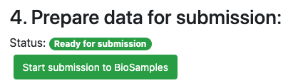
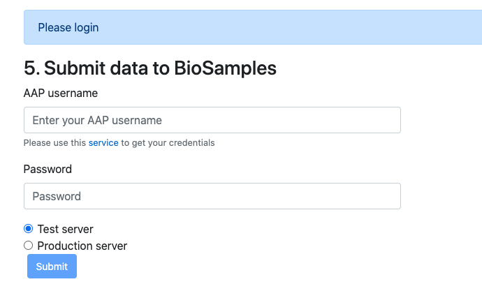
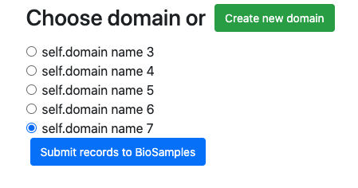
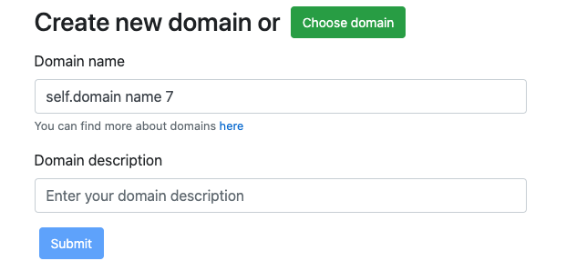
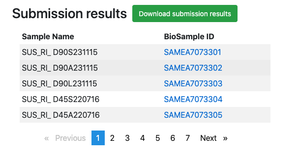

# Submission to BioSamples
1. After successful [validation](biosamples_validation_conversion.md) you 
should be allowed to do a submission 
to [BioSamples](https://www.ebi.ac.uk/biosamples/) using our 
[on-line tool](https://data.faang.org/validation/samples). Just click on 
**"Start submission to BioSamples"** button on 4th stage.  

2. Next you will need to provide your AAP credentials. Please follow 
instructions provided in form, we would recommend to start from 
**"Test server"** submission. Pleas keep in mind that you need to create two 
seprate AAP accounts for [test](https://explore.aai.ebi.ac.uk/registerUser) and
[production](https://aai.ebi.ac.uk/registerUser) servers. Credentials from one 
account won't work on another.

3. Next you will need to choose from existing domains or a create new one, please
follow instructions provided in a form. Then click 
**"Submit records to BioSamples"**

4. After successful submission you will get you results in a table, also browser
will start automatic **submission results** download. If it won't happen 
please use **"Download submission results"** button. It's really important to 
save this file in a safe place for further reference

