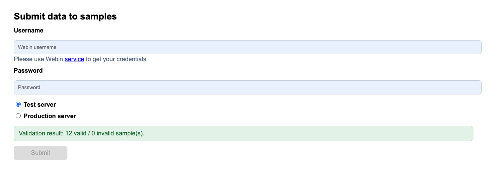
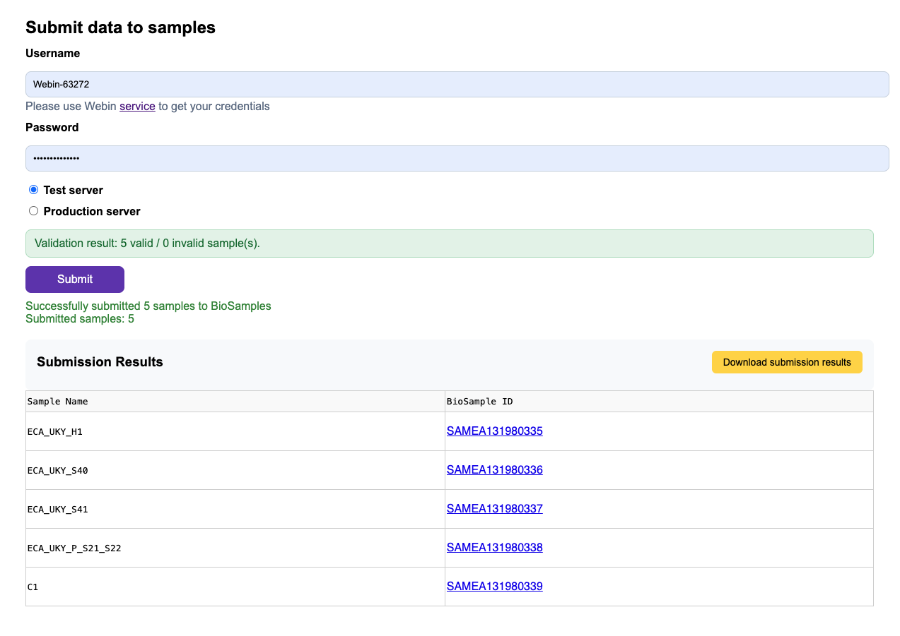

# Submission to BioSamples
1. After successful [validation](biosamples_validation_conversion.md) you 
should be allowed to do a submission 
to [BioSamples](https://www.ebi.ac.uk/biosamples/) using our 
[on-line tool](https://data.faang.org/validation/samples). 

2. You'll need to provide your WEBIN credentials for this step. If you don't have WEBIN credentials yet, you can create them first.
We recommend starting with the **"Test server"** to test your submission before using production.

3. Clicking on the 'Submit' button will submit the validated records to BioSamples

4. After successful submission you will get you results in a table, also browser
will start automatic **submission results** download. If it won't happen 
please use **"Download submission results"** button. It's really important to 
save this file in a safe place for further reference.

