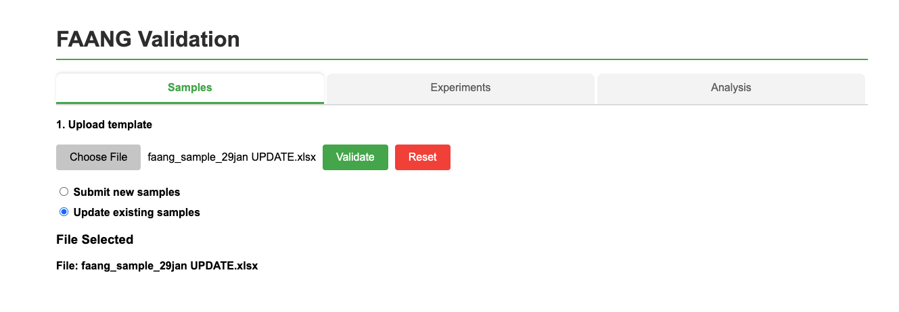
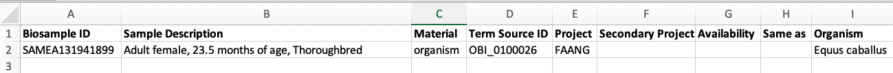

# Updating existing BioSamples records

To update existing BioSamples records, you'll need to use a modified template and follow a specific process.

## Update Process

1. Select the **"Update existing samples"** option in the validation tool

2. Upload your completed template containing the data you want to update

3. Ensure each entry in your spreadsheet contains the correct **BioSample ID**

4. Verify that relationship columns (such as 'Derived From') contain the BioSample ID of the related sample

## Important Notes

**Template Changes**: In update spreadsheets, the 'Sample Name' column is replaced with 'BioSample ID'. Refer to the provided example template for updates.

**Data Requirements**: This action will update the sample details with the metadata you provide, so ensure all information is accurate before submission.

## Alternative Method

You can also update samples directly using the BioSamples API by following [this guide](https://www.ebi.ac.uk/biosamples/docs/references/api/submit#_update_sample).

